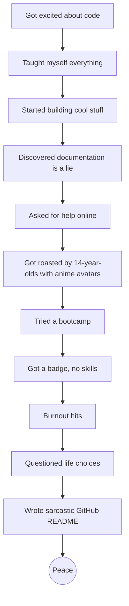

# 🧑‍🚀 Welcome to my GitHub

…where nothing happens, on purpose.

---

## FAQ:

**Q: Why don’t you have any projects here?**  
A: Because modern programming cured me of joy.

**Q: Wait, what happened?**  
A: Imagine trying to build a house, but every brick is from a different country, labeled in a language no one speaks, and the instruction manual just says “Good luck 💅.”

**Q: There’s so much free info online!**  
A: Free? You mean the $599 “Ultimate Junior Dev MegaCourse” that ends with “Set up a portfolio and pray”?  
Yeah. Free.

**Q: What about the community?**  
A: It’s amazing. Especially if you love sarcasm, superiority complexes, and being told “just read the docs” when the docs are literally a broken link to an empty page.

**Q: So are you done coding forever?**  
A: Let’s call it a trial separation. If programming decides to work on itself, maybe we’ll talk.  
Until then, I’m seeing other hobbies.

---

## 🔥 Hire Me Never™

I’m not available.  
I’m not freelancing.  
I’m not open to collab.  
I’m *free*.

---

## 📉 My Programming Journey (a totally serious chart)

---

## 🎁 And Finally… My Programming Career in One GIF:

---

*Thanks for stopping by.  
Feel free to browse my empty repositories — or don’t.  
They're not going anywhere.*
